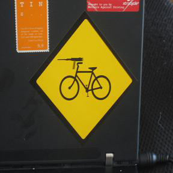
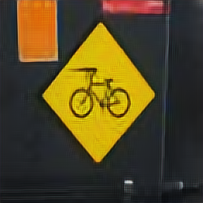
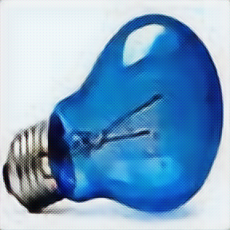

# Image Super-Resolution
## Overview
A CNN architechture (with residual connections) is trained to transform low resolution images to high resolution. The input to the model is a 72x72 image which is fed through a series of convolutional and residual blocks (to learn necessary features), and then upsampled (either by `UpSampling2D` or `Deconv2D` from `Keras`) to obtain a 288x288 image. 
__Loss__: The loss used in for training the network is 'perceptual loss' or 'content loss'. Basically, both the generated high resolution image (G) and the original high resolution image (O) are fed to a VGG-16 network's conv base (not allowed to be trainable). The outputs at specific convolutional blocks for image G and image O are compared in terms of mean squared error (MSE), which is the loss function to be minimized. 

## Dataset
The [MIRFLICKR25000](http://press.liacs.nl/mirflickr/) dataset was used for this project. Out of the 25k images, 200 each was kept aside for validation and test. 

## Requirements
- Keras==2.0.8
- Pillow==4.1.1
- numpy==1.12.1
- scikit-learn==0.18.1
- tqdm==4.19.1

## Instructions
The dataset orginally has images of different heights and widths. The `create_dataset.ipynb` notebook can be used to generate the low resolution and high resolution versions of all the images. The code for the actual model is present in `super_res.ipynb`.

## Results
The following are the results when using `UpSampling2D`.

__Original Image:__
 

 

__Low Resolution Input:__
 

 

__Generated High Resolution Output:__
 

 

The learnt weights of the convolutional filters do not depend on the input image size. So, another model that takes a 288x288 images and generates a __4X__ higher resolution image was created by transferring the weights. The results quite good as shown below: 

__Generated 4X High Resolution Output:__
 

 

### Checkerboard Artifacts
An observation that can be made is that `Deconv2D` (when used instead of `UpSampling2D`), results in checkerboard artifacts. Refer to (this article)[https://distill.pub/2016/deconv-checkerboard/] for further details.

 

 

 

 

## Acknowledgements
This project was done following the lecture materials of the [fast.ai course](http://course.fast.ai/lessons/lesson9.html) offered by Jeremy Howard.
